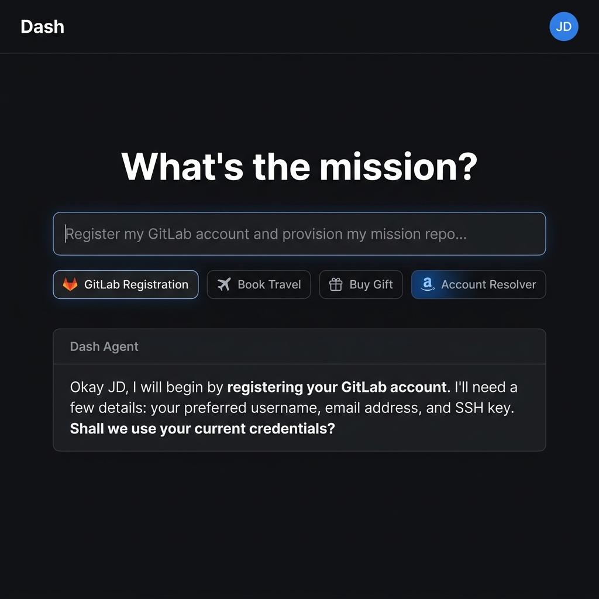
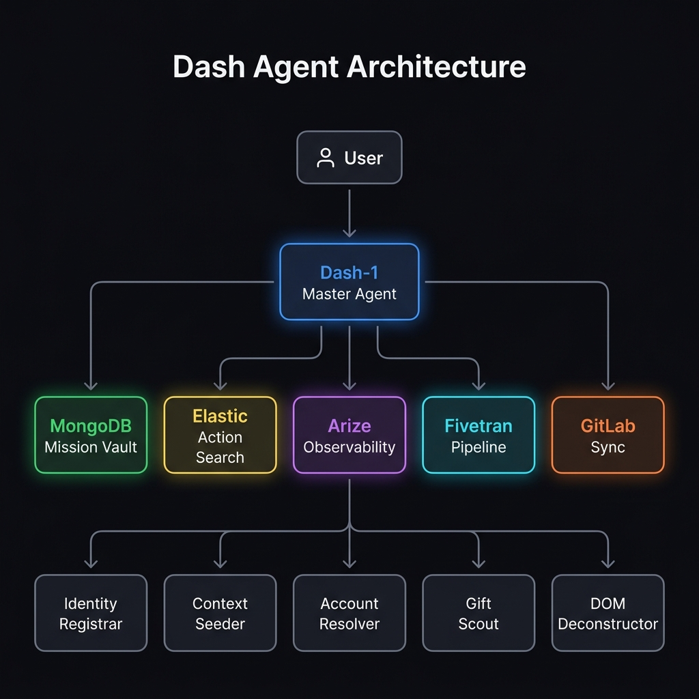
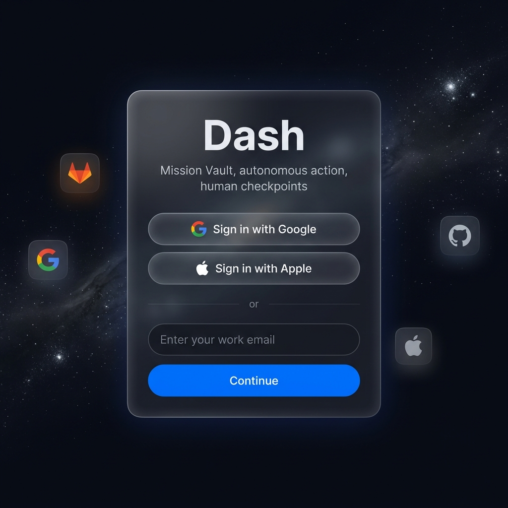
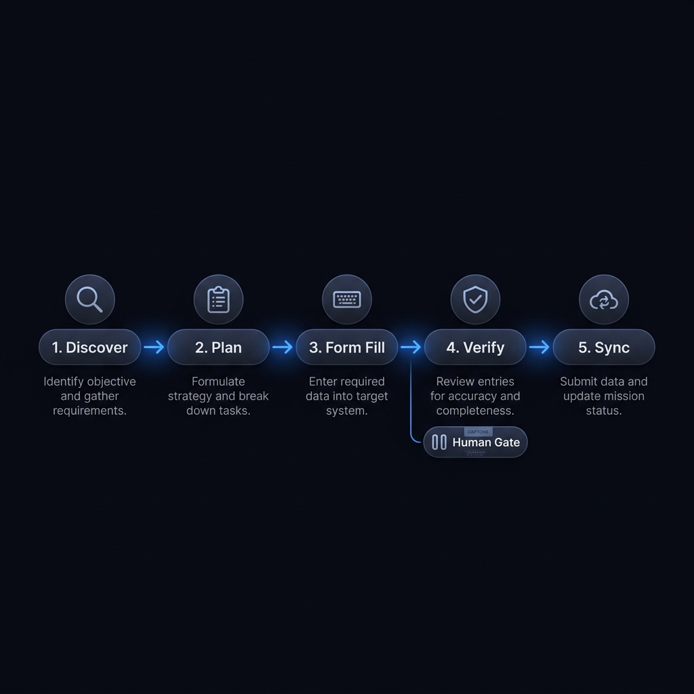

# Dash — AI That Doesn't Just Answer. It Acts.

**Live Demo → [https://dash-agent.onrender.com](https://dash-agent.onrender.com)**

[](LICENSE)
[](https://ai.google.dev)
[](https://www.mongodb.com)
[](https://www.elastic.co)
[](https://gitlab.com)
[](https://arize.com)

Dash is built to run against real partner services. MongoDB provides the mission vault, Elastic caches solved UI actions, Arize monitors reasoning and guardrails, Fivetran streams mission analytics, Dynatrace captures runtime telemetry, and GitLab is available as optional mission-script versioning when configured. This is the actual live toolbox behind the webapp.

---

<table>
  <tr>
    <td width="50%"></td>
    <td width="50%"></td>
  </tr>
  <tr>
    <td align="center"><sub>The command surface — clean, conversational, action-oriented</sub></td>
    <td align="center"><sub>Under the hood — Gemini orchestrating MongoDB, Elastic, GitLab, Arize &amp; Fivetran</sub></td>
  </tr>
  <tr>
    <td width="50%"></td>
    <td width="50%"></td>
  </tr>
  <tr>
    <td align="center"><sub>Identity verified by consent — Google OAuth or demo login</sub></td>
    <td align="center"><sub>The 5-phase mission lifecycle with human checkpoint gate</sub></td>
  </tr>
</table>

---

## What Is Dash?

Most AI tools are question-answering machines. Dash is different.

Dash is a **real-world action agent** — a minimalist command surface powered by Gemini 2.5 that can plan, remember, browse, fill forms, register accounts, scout products, compare flights, and stop precisely when a human needs to be in the loop. It doesn't simulate these actions. It uses a live Playwright-driven browser, Gemini's reasoning, and a network of partner superpowers to actually *do things* on the web under your oversight.

The design philosophy is **"Silent Power"**: the interface stays clean and conversational, all the heavy orchestration happens invisibly in the background, and you only see high-level outcomes — never raw DOM dumps, telemetry, or logs.

---

## What Dash Can Do

| Mission | What happens |
|---------|-------------|
| **Account Resolver** | Navigates to any registration or login page, uses Gemini to semantically map the form fields, fills them with approved profile data, and pauses at CAPTCHA, MFA, or email verification |
| **Gift Scout** | Uses consented context (interests, age, budget, relationship), applies international shipping constraints, and ranks gift options by interest fit, price confidence, seller reliability, novelty, and delivery risk |
| **Travel Concierge** | Plans flights, stays, dates, and package deals with full awareness of home airport, budget, and passport constraints — stops before booking |
| **Shopping Scout** | Compares products with landed cost, return risk, international shipping availability, and checkout readiness |
| **Social Manager** | Drafts campaigns, content calendars, and posting schedules — stops before publishing without explicit approval |
| **Workflow Architect** | Designs durable recurring workflows with trigger conditions, tool steps, checkpoints, and autonomy levels |

---

## The Mission Lifecycle

Every Dash task runs through five phases, displayed live in the UI:

```
Find → Read → Prepare → Check → Save
```

1. **Find** — Route the request, locate the right pages or services, load user context from MongoDB
2. **Read** — Deconstruct visible text, ARIA roles, labels, placeholders, form hierarchy, and button semantics using Playwright
3. **Prepare** — Ask Gemini to map fields to approved profile keys, fill forms, draft content, or shortlist options
4. **Check** — Pause immediately for CAPTCHA, MFA, email/phone verification, payment, publishing, or irreversible changes
5. **Save** — Write high-level mission state, preferences, and non-secret session references back to MongoDB

## For Judges — Quick Start

You don't need to clone the repo to review the app. The live site supports judge entry via Demo Login and your own Gemini key.

**Path A: Live judge review (recommended)**
1. Visit the live URL: [https://dash-agent.onrender.com](https://dash-agent.onrender.com)
2. On the login card, click **Continue with Demo**.
3. Optionally paste your own **Gemini API Key** into the top login field and click **Validate & Use**.
4. After login, open **Settings** to confirm your key is stored and to paste any partner keys you want to test.
5. Use the **Connect with Google** button or **Create a new account** button to exercise the identity flows.
6. The small provider icons under “Or connect LLM accounts” let judges see the provider staging UI for GitHub, Microsoft, Anthropic, and OpenAI.
7. If you do not have a Gemini key, the app falls back to the server-side backend key for the current session.

**Path B: Full test locally**
1. Clone: `git clone https://github.com/D1Bastian/Dash-Agent.git`
2. Configure: `cp .env.example .env.local` and add your `GEMINI_API_KEY` or any partner keys you have.
3. Run: `pip install -r requirements.txt && uvicorn backend.main:app --reload`

## Judge-first features
- ✅ Live judge entry: the login overlay exposes **Demo Login**, **Create a new account**, **Connect with Google**, and personal Gemini key entry.
- ✅ Real Gemini Key support: `saveGeminiKey` in `app.js` validates and stores the judge's key for the session.
- ✅ App stores keys for the session and injects `X-Gemini-Key` into backend requests.
- ✅ Connect LLM accounts section: GitHub, Microsoft, Anthropic, and OpenAI provider buttons are visible on the login screen.
- ✅ Google OAuth support: `/auth/google/url` and `/auth/google/callback` are implemented; non-configured OAuth providers gracefully stage/demo fallback flows.
- ✅ Partner integration fallbacks: partner services are live when env vars are configured, otherwise Dry Run / fallback state prevents crashes.
- ✅ Judge-friendly health checks: `/health` and `/health/partners` report current integration state.

---

## Partner Superpowers

Dash is built on six partner integrations that turn a smart chat interface into a capable agent. The Gemini master agent treats these services as active toolbox capabilities, using them for action recall, observability, analytics, telemetry, memory, and optional script versioning.

| Partner | Superpower | What It Enables | Status |
|---------|-----------|-----------------|--------|
| **MongoDB** | Mission Vault | Durable memory of user preferences, consent, context sources, and mission state. | 🟢 Connected |
| **Elastic** | Action Search | Caches previously solved DOM/form mappings to accelerate form-filling. | 🟢 Active when configured |
| **GitLab** | Mission Scripts | Versions and syncs mission execution scripts. | 🟡 Optional / token required |
| **Arize** | Observability | Traces Gemini reasoning chains and monitors safety guardrails. | 🟢 Active when configured |
| **Fivetran** | Data Pipeline | Streams mission event data (price trends, trip costs, scout results). | 🟢 Active when configured |
| **Dynatrace** | Runtime Telemetry | Monitors backend health and operational performance. | 🟢 Active when configured |

*Note to Judges: The live demo uses MongoDB as the mission vault and is designed to treat Elastic, Arize, Fivetran, and Dynatrace as real toolbox extensions when those partners are configured. GitLab remains optional and only runs if `GITLAB_TOKEN` or a GitLab MCP URL is provided. If partner keys are not supplied, the integrations fall back to dry-run mode so the agent stays stable.*

---

## Architecture

```
User prompt (chat)
  → Dash-1 Master Agent (Gemini 2.5)
  → MongoDB Mission Vault — load user context & memory
  → Mission Router — classify intent & spawn specialist sub-agents
      ├── Account Resolver     (Playwright + Gemini DOM mapping)
      ├── Product Scout        (price, shipping, ranking)
      ├── Travel Concierge     (flight, stay, logistics)
      ├── Gift Scout           (social context + ranked recommendations)
      ├── Social Manager       (draft, schedule, gate before publish)
      └── Workflow Architect   (recurring mission design)
  → Human Checkpoint Gate      (CAPTCHA / MFA / payment / publish)
  → Elastic — cache solved actions
  → MongoDB — save mission state & non-secret session refs
  → Arize — log reasoning trace
  → Fivetran — stream mission analytics
  → Dynatrace — emit runtime telemetry
  → Fivetran — stream mission analytics
  → Dynatrace — emit runtime telemetry
```

## Health Check

```bash
curl https://dash-agent.onrender.com/health
curl https://dash-agent.onrender.com/health/partners
```

The `/health` endpoint reports Gemini model, API key status, and which partner integrations are live vs. dry-run. The `/health/partners` endpoint pings each service and returns real latency measurements.

---

## Hackathon Track

**Primary: MongoDB** — The Mission Vault is the backbone of everything Dash does. Without persistent, consented memory, the agent would be stateless and would ask the same questions on every run. MongoDB turns Dash from a one-shot tool into a trusted assistant that compounds its knowledge over time.

**Secondary proof points:** Elastic (action recall), Arize (observability), GitLab (script versioning), Fivetran (event pipeline), Dynatrace (telemetry).

---

## License

MIT — see [LICENSE](LICENSE).
